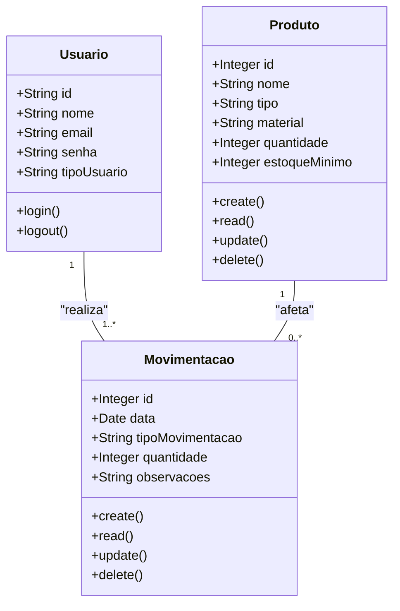

# Sistema de Gestão de Estoque (Formativa)

# Briefing

# Visão Geral do Projeto
O projeto consiste no desenvolvimento de um **Sistema de Gestão de Estoque** no formato de aplicação web para uso interno da **fábrica de ferramentas e equipamentos manuais.**
O sistema substituirá o controle manual (planilhas ou cadernos) da entrada e saída de produtos, evitando falta ou excesso de estoque, rastreando movimentações e garantindo segurança e confiabilidade das informações.

A aplicação permitirá o **cadastro de produtos,** **controle de estoque mínimo, movimentações de entrada e saída, alertas automáticos e histórico de operações, identificando o usuário responsável e a data da operação.**

## Escopo

### Objetivos:
- Centralizar informações: Unificar os dados de produtos e movimentações em um único sistema.
- Evitar falta ou excesso de estoque: Alertas automáticos de estoque mínimo.
- Otimizar o trabalho do almoxarifado: Facilitar o registro de entradas e saídas.
- Garantir rastreabilidade: Registrar histórico de movimentações, usuário e data.
- Aumentar confiabilidade: Dados seguros e organizados, com acesso restrito.

### Público-Alvo:
- Administrador: Pode cadastrar produtos, registrar movimentações, visualizar estoque, alertas e histórico de operações.

### Recursos Tecnológicos:
- Frontend: Next.js
- Backend: Node.js
- Banco de Dados: MongoDB (nova versão)
- Sistema Operacional: Windows 10
- Controle de versão: Git/GitHub
- Ferramentas de design e modelagem: Mermaid / Figma

### Diagramas (Mermaid)
1. Diagrama de Classes

Modela as principais entidades do sistema: Produto, Movimentacao e Usuario.




### Explicação:
Um Produto pode ter várias movimentações.
Um Usuário realiza várias movimentações de estoque.
Cada movimentação afeta apenas um produto por vez.

2. ## Diagrama de Casos de Uso

Mostra as interações do usuário (Almoxarife/Supervisor) com o sistema.

```mermaid
graph TD
    subgraph Sistema de Gestão de Estoque
        uc1("Fazer Login")
        uc2("Gerenciar Produtos (CRUD)")
        uc3("Registrar Movimentação de Estoque")
        uc4("Visualizar Estoque")
        uc5("Ver Alertas de Estoque Mínimo")
        uc6("Consultar Histórico de Movimentações")
    end

    actor "Administrador" as Admin

    Admin -- uc1
    Admin -- uc2
    Admin -- uc3
    Admin -- uc4
    Admin -- uc5
    Admin -- uc6

    uc2 --|> uc1 : include
    uc3 --|> uc1 : include
    uc4 --|> uc1 : include
    uc5 --|> uc1 : include
    uc6 --|> uc1 : include
```

### Explicação:
Administrador: Pode gerenciar produtos, movimentações, visualizar estoque, alertas e histórico de operações.
Todos os casos de uso dependem do login (relação include).

3. Diagrama de Fluxo (Movimentação de Estoque)

Mostra o processo completo de entrada ou saída de produtos no estoque.

```mermaid
graph TD
    A[Início] --> B{Usuário faz login?}
    B -- Não --> C[Exibe tela de login]
    B -- Sim --> D[Acessa módulo de movimentações]
    D --> E[Seleciona produto]
    E --> F[Escolhe tipo de movimentação (Entrada/Saída)]
    F --> G[Insere quantidade e data]
    G --> H[Verifica estoque mínimo (se saída)]
    H -- Estoque suficiente --> I[Registra movimentação no banco]
    H -- Estoque insuficiente --> J[Exibe alerta de estoque mínimo]
    I --> K[Exibe mensagem: "Movimentação registrada com sucesso"]
    J --> I
    K --> L[Fim]

```

### Explicação:
O usuário precisa estar autenticado.
O sistema verifica automaticamente o estoque mínimo para saídas.
Todas as movimentações são registradas no banco de dados com rastreabilidade do usuário.

4. ### Matriz de Análise de Risco
ID	Risco	Probabilidade	Impacto	Mitigação
1	Estoque negativo	Média	Alto	Verificação automática antes da saída, com alerta ao usuário
2	Perda de dados	Baixa	Alto	Backups automáticos e banco em nuvem
3	Falhas na autenticação	Baixa	Alto	JWT seguro e renovação periódica de tokens
4	Lentidão com grande volume de produtos	Média	Média	Indexação de campos de busca e paginação
5	Erros na inserção de produto	Média	Médio	Validação de dados e alertas ao usuário
6	Falta de treinamento	Média	Médio	Interface intuitiva e tutoriais

5. ### Riscos de Gerenciamento / Organização
ID	Risco	Probabilidade	Impacto	Mitigação
1	Atrasos no desenvolvimento do sistema	Alta	Média	Adotar metodologia ágil, definir prioridades de MVP e realizar reuniões periódicas de acompanhamento
2	Uso incorreto do sistema (ex: registrar movimentações duplicadas ou erradas)	Média	Alto	Implementar validação de dados, alertas e confirmações antes de registrar movimentações
3	Comunicação ineficiente entre equipe de TI e almoxarifado	Média	Médio	Estabelecer canais claros de comunicação e reuniões regulares de alinhamento
4	Resistência à mudança dos usuários	Média	Médio	Demonstrar benefícios do sistema, treinamento e suporte contínuo