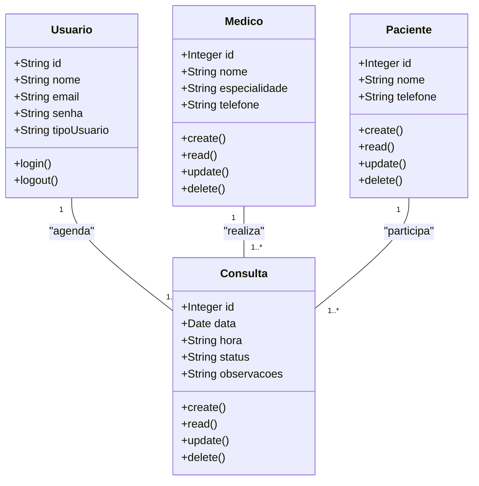

# Sistema de Agendamento de Consultas (Formativa)

# Briefing

## Visão Geral do Projeto
O projeto consiste no desenvolvimento de um **Sistema de Agendamento de Consultas** no formato de uma aplicação web, para uso interno da **Clínica Saúde & Bem-estar**.  
O sistema visa substituir o controle manual (em cadernos) das agendas médicas, que gera confusões, rasuras e retrabalho, por uma plataforma digital eficiente, segura e intuitiva.

A aplicação permitirá o **cadastro de pacientes e médicos**, além do **agendamento, cancelamento e acompanhamento de consultas**, com controle de disponibilidade de horários.

## Escopo

### Objetivos:
- Centralizar informações:** Unificar os dados de pacientes, médicos e consultas em um único sistema.  
- Evitar conflitos de horário:** Impedir que o mesmo médico tenha duas consultas marcadas no mesmo horário.  
- Otimizar o trabalho da recepção:** Facilitar o agendamento, reagendamento e cancelamento de consultas.  
- Melhorar a comunicação:** Permitir que médicos visualizem facilmente suas agendas diárias e semanais.  
- Aumentar a confiabilidade:** Garantir que os dados fiquem salvos, organizados e com acesso restrito por perfil de usuário.

### Público-Alvo:
- Recepcionista (Gestor):** Pode cadastrar pacientes, médicos e realizar a gestão completa das consultas (criar, reagendar, cancelar).  
- Médico: Visualiza apenas sua própria agenda, com os detalhes de suas consultas.  

### Recursos Tecnológicos:
- Frontend:Next.js 
- Backend: Node.js  
- Banco de Dados: MongoDB 
- Controle de versão: Git/GitHub  
- Ferramentas de design e modelagem: Mermaid/figma

## Diagramas (Mermaid, Miro, Draw.io)

### 1. Diagrama de Classes
Este diagrama modela as principais entidades do sistema: **Paciente**, **Médico**, **Consulta** e **Usuário (Recepcionista)**.



### Explicação:
Um Paciente pode ter várias Consultas.

Um Médico realiza várias Consultas, mas cada consulta pertence a um único médico.

O Usuário (Recepcionista) é o responsável por agendar as consultas no sistema.

2. ### Diagrama de Casos de Uso
Mostra as interações dos usuários (Recepcionista e Médico) com o sistema.

```mermaid
graph TD
  subgraph Sistema_de_Agendamento_de_Consultas
    uc1["Fazer Login"]
    uc2["Gerenciar Pacientes (CRUD)"]
    uc3["Gerenciar Médicos (CRUD)"]
    uc4["Agendar Consulta"]
    uc5["Cancelar/Reagendar Consulta"]
    uc6["Visualizar Agenda"]
  end

  Recepcionista(("Recepcionista"))
  Medico(("Médico"))

  Recepcionista --> uc1
  Recepcionista --> uc2
  Recepcionista --> uc3
  Recepcionista --> uc4
  Recepcionista --> uc5
  Recepcionista --> uc6

  Medico --> uc1
  Medico --> uc6

  uc4 -.-> uc1
  uc5 -.-> uc1
  uc2 -.-> uc1
  uc3 -.-> uc1
  uc6 -.-> uc1

###  Explicação:
Recepcionista: Pode cadastrar médicos e pacientes, criar e gerenciar consultas, e visualizar a agenda completa.

Médico: Faz login e visualiza apenas suas consultas agendadas.

Todos os casos de uso principais dependem do login (relação include).

3. Diagrama de Fluxo (Agendamento de Consulta)
Mostra o processo completo de criação de uma nova consulta no sistema.

```mermaid

graph TD
    A[Início] --> B{Usuário faz login?}
    B -- Não --> C[Exibe tela de login]
    B -- Sim --> D[Acessa módulo de agendamentos]
    D --> E[Seleciona médico e data]
    E --> F[Verifica disponibilidade do horário]
    F -- Horário disponível --> G[Seleciona paciente]
    G --> H[Confirma data e hora]
    H --> I[Cria registro da consulta no banco de dados]
    I --> J[Exibe mensagem: "Consulta agendada com sucesso"]
    F -- Horário ocupado --> K[Exibe erro: "Horário indisponível"]
    J --> L[Fim]
    K --> E

```

### Explicação:
O usuário (recepcionista) precisa estar autenticado.

O sistema impede o agendamento em horários já ocupados para o mesmo médico.

Após a criação, a consulta é salva e vinculada ao médico e paciente.

### Análise de Risco

### Matriz de Análise de Risco do Projeto
Riscos Técnicos
ID	Risco	Probabilidade	Impacto	Mitigação
1	Conflito de horário entre consultas	Média	Alto	Implementar validação de disponibilidade por médico e horário antes de confirmar o agendamento.
2	Perda de dados devido a erro de servidor	Baixa	Alto	Utilizar backups automáticos e banco de dados em nuvem com redundância.
3	Falhas na autenticação JWT	Baixa	Alto	Usar bibliotecas testadas, chaves seguras e renovação periódica de tokens.
4	Lentidão com grande volume de dados	Média	Média	Indexar campos de busca e aplicar paginação nas listas.

### Riscos de Gerenciamento / Organização
ID	Risco	Probabilidade	Impacto	Mitigação
5	Atrasos no desenvolvimento	Alta	Média	Aplicar metodologia ágil e definir prioridades de MVP.
6	Falta de treinamento da recepcionista	Média	Média	Criar tutoriais e interface simples e intuitiva.
7	Uso incorreto do sistema (ex: duplicar consultas)	Média	Alta	Implementar mensagens de confirmação e bloqueio de duplicatas.

## Prototipagem


## Codificação
